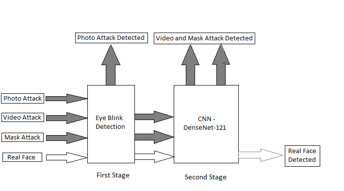
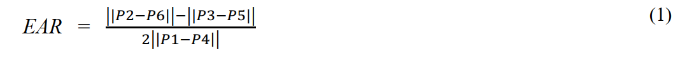
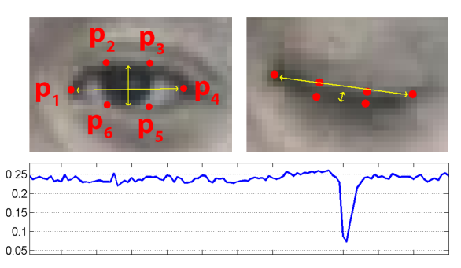
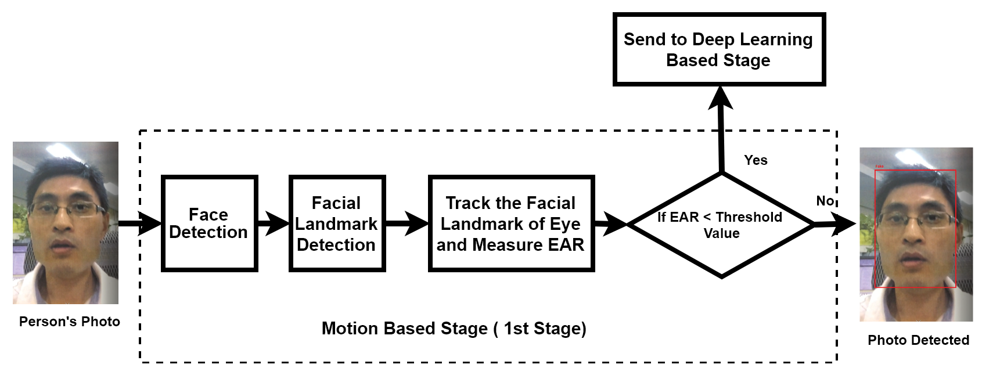
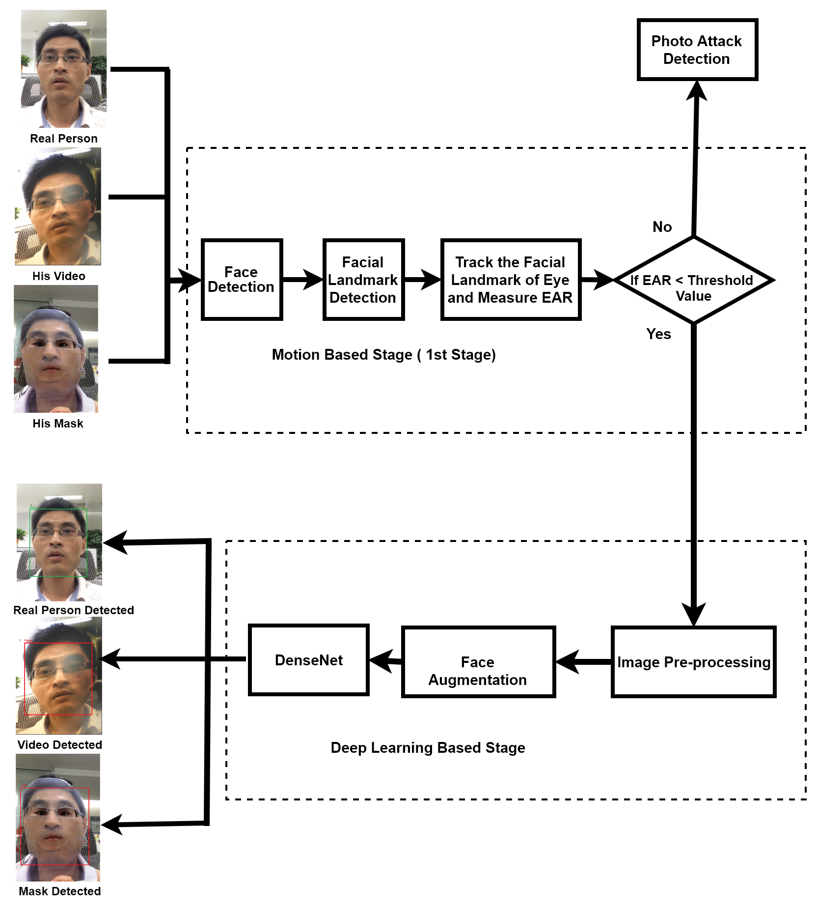
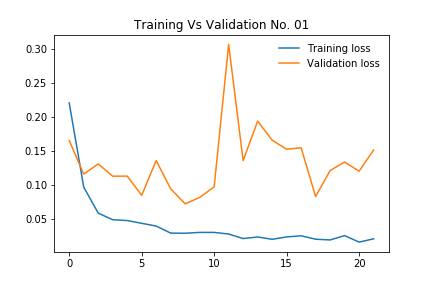
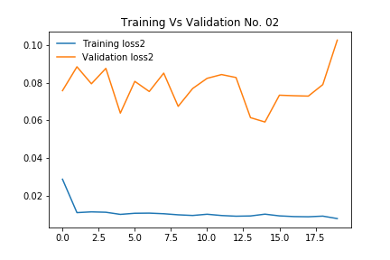

# Efficient Two Stage Approach to Detect Face Liveness : Motion Based and Deep Learning Based
## Introduction

  Face liveness detection is a big challenge for the researcher. Face recognition based security system suffer from
  spoofing attack, because of lacking of proper face liveness detection system. In this paper, we proposed a new approach to
  prevent spoofing attack with a two stage approach, one is motion based and another is deep learning based. The network
  is train on <a href="http://rose1.ntu.edu.sg/Datasets/faceLivenessDetection.asp">ROSE-Youtu Face Liveness Detection
  Database</a>. The whole model is test on real time videos from webcam. This combine approach gives a better performance
  than other approaches in ROSE-Youtu Face Liveness Detection Database. Our proposed model gives an accuracy of 95.44% and
  error rate of 4.56% which is better than existing models on ROSE-Youtu Face Liveness Detection Database.

## Methodology

  In this project the proposed methodology consists of two stage. At first stage, it will detect the eye blink of face. If
  the eye of face is not blinked, then it detects the face as fake face. And if the eye is blinked, then it goes to second
  stage for further analysis. At second stage, the blinked face is passed through the CNN to decide, whether it is real or
  fake. Eye blink can consider as the switch of CNN as face will pass through the CNN if and only if the eye is blinked. 
  Fig. 1 shows the proposed methodology.

  
  <figcaption>Fig. 1 : Two stage protection to prevent spoofing attack.</figcaption>

## Proposed Algorithm
### First Stage ( Motion Based )

  At first stage face will be detected from the real time video from webcam. Then we have to detect facial landmark,
  dlib based facial landmark detection is used here. Then the landmark of eye will be tracked to detect eye blink. The
  real time eye blinking is detected by measuring Eye Aspect Ratio (EAR). EAR can be understood easily from Fig. 2 and
  can be expressed as equation (1)

  
  <figcaption>Fig. 2 : Eye aspect ratio falls when the eye blink.</figcaption>

  In Fig. 2,P1 to P5 indicate the landmark of eye. When the eye blinked the aspect ratio falls, so this detect that the face
  is blinked. So in summary, when video is taken from Logitech C310 Webcam, at first the face is detected as Region of
  Interest (ROI) and then detect is eye blink or not? If not blink then the program shows the face as a fake face. If the
  face blinked, then the face will send to deep learning based stage for further investigation. The whole stage can be easily
  understood from the following Fig 3.

  
  Fig. 3 : Algorithm for detect photo of a person.

### Second Stage ( Deep Learning Based )

  When the blinked face pass through the DenseNet, firstly it will be preprocessed such as resizing, cropping etc. Then
  Face Augmentation is applied to increase the size of dataset.Face Augmentation technique such as horizontal flipping,
  zoom in , zoom out etc. are applied to increase the number of sample in the dataset. Because using this technique we can
  make different image from the same image. Face Augmentation increase the accuracy as more data is feed into the CNN, so our
  CNN will learn more. As already mention that the CNN is trained on real face, masked face and video face, so it detect that
  the face is real or masked face or video face. If it finds the face as real, then it shows the face is real. On the other
  hand, if it detects any kind of spoofing attack, then it shows that the face is fake. This stage can be easily understood
  from the Fig.4. Using this procedure the model is run in real time using Logitech C310 Web Cam.

  
  Fig. 4 : Algorithm to detect the real person, his video and mask

## Result and Analysis

  Firstly, the model is trained for 22 epochs at learning rate 0.001, the lowest validation loss was found 0.072107
  and on that loss validation accuracy was 0.974649. This model was saved. After that the saved model was trained again for
  20 epochs using learning rate 0.0001 and find the lowest validation loss was 0.059059 and on that loss validation accuracy
  was 0.978635. So we got 97.86% accuracy in validation dataset. The validation and training loss have been plotted as shown 
  is Fig. 4(a) and 4(b).

<figure>
  
  <figcaption>Fig. 4(a) : Train and validation loss at 1st training at learning rate 0.001</figcaption>
</figure>

<figure align="center">
  
  Fig. 4(b) : Train and validation loss at 2nd training at learning rate 0.0001
</figure>

#### Table 1: Performace Comparision of the Proposed Model

Method | EER (%)
------------ | -------------
LBP-TOP (de Freitas, Pereira 2014) | 25.0
Quality (Wen, 2015) | 39.5
Color Texure (Boulk enafet, 2016) | 9.6
MsLBP (Matta, 2011) | 27.1
CNN (Yang, 2014) | 7.0
Proposed Model | 4.56

## Conclusion

  A more accurate model with two stages of face liveness detection with real time analysis is proposed in this paper.The key 
  of the success is to share the load of liveness detection among the two stages. If we can add more proper stages, then the 
  accuracy of the model may also increase. To choose proper stages for liveness detection, every type of spoofing attack 
  should be analyzed properly to find their unique properties. Based on their property, the stages should be designed. By 
  using analogy, more robust and accurate model for face liveness detection can be designed.

## Real Time Output
* <a href="https://youtu.be/AsztKgsm2CU">Photo Attack</a>
* <a href="https://youtu.be/OrxPr2bmgS8">Video Attack</a>
## Prerequisite
* Pytorch 1.1
* Python 3.6
#### The pretrain model can be found <a href="https://drive.google.com/open?id=1V3F734oa_29SLLvwe6gGgjzg65zP86zl">here</a>

## If any portion of this research helps anyones research, please cite the following paper.

  Md. Mehedi Hasan, Md. Salah Uddin Yusuf, Shidhartho Roy and Tanbin Islam Rohan , "Efficient two stage approach to detect 
  face liveness : Motion based and Deep learning based", 4th International Conference on Electrical Information and 
  Communication Technology (EICT), Khulna, Bangladesh, 2019.

